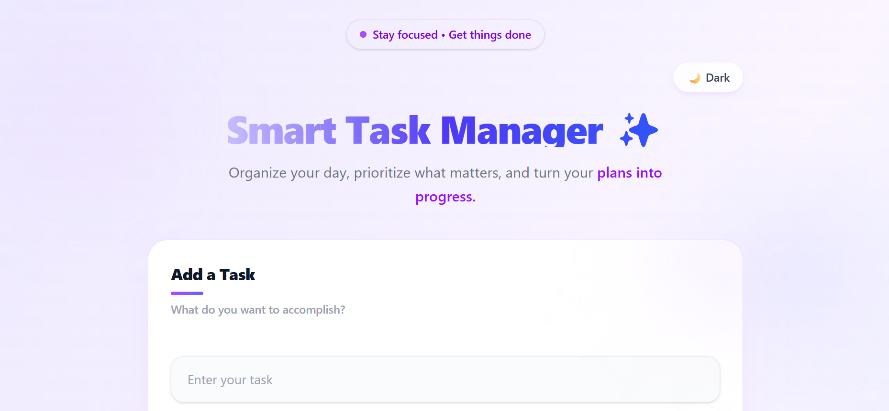
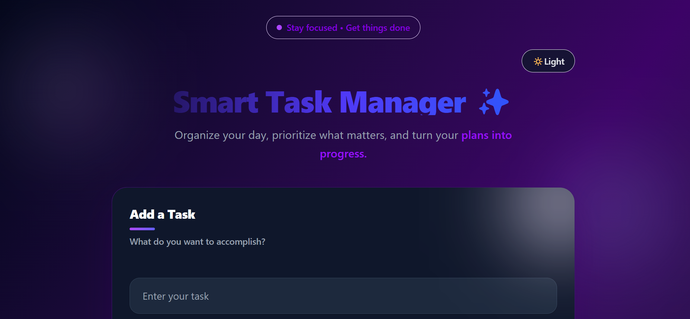
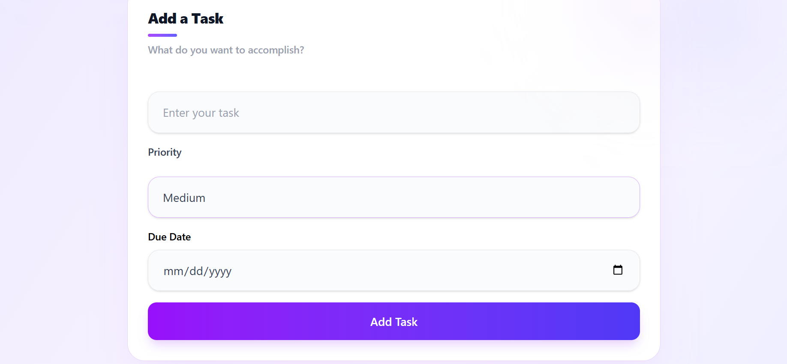
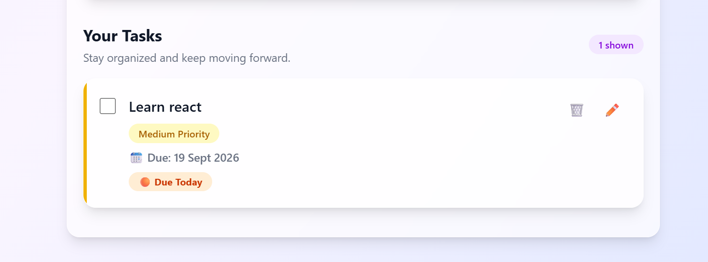

#  Smart Task Manager

A modern and responsive task management application built with **React, TypeScript, and Tailwind CSS**. Smart Task Manager helps users organize daily tasks with priorities, due dates, progress tracking, search, filtering, Smart Sort, and persistent local storage.

## ✨ Features

* ➕ Add new tasks
* ✏️ Edit existing tasks
* 🗑️ Delete tasks
* ✅ Mark tasks as completed
* 🎯 Set task priorities — Low, Medium, High
* 📅 Add due dates to tasks
* 🔴 Automatic overdue status
* 🟠 Due Today status
* 🟡 Due Tomorrow status
* 🔍 Search tasks
* 🔎 Filter tasks by All, Active, and Completed
* ✨ Smart Sort based on completion and priority
* 📊 Task statistics and progress tracking
* 🌙 Dark / Light mode
* 💾 Persistent data using LocalStorage
* ⌨️ Add tasks using the Enter key
* 🛡️ Empty task validation
* 🎨 Responsive and modern UI
* ✨ Smooth hover and transition animations

## 🛠️ Tech Stack

* **React**
* **TypeScript**
* **Tailwind CSS**
* **Vite**
* **LocalStorage**
* **ESLint**

## 📂 Project Structure

```text
smart-task-manager/
├── src/
│   ├── components/
│   │   ├── TaskInput.tsx
│   │   ├── TaskItem.tsx
│   │   └── TaskList.tsx
│   │
│   ├── types/
│   │   └── task.ts
│   │
│   ├── App.tsx
│   ├── main.tsx
│   └── index.css
│
├── public/
├── package.json
├── vite.config.ts
└── README.md
```

## 🚀 Getting Started

### 1. Clone the repository

```bash
git clone https://github.com/Anshika-404/smart-task-manager
```

### 2. Navigate to the project

```bash
cd smart-task-manager
```

### 3. Install dependencies

```bash
npm install
```

### 4. Start the development server

```bash
npm run dev
```

Open the local development URL shown in your terminal.

## 💡 How It Works

Tasks are managed using React state and stored in the browser's **LocalStorage**, allowing tasks and theme preferences to remain available even after refreshing the page.

The application also provides Smart Sort, which organizes active tasks according to their priority while keeping completed tasks lower in the list.

Due dates are used to automatically identify tasks as **Overdue**, **Due Today**, or **Due Tomorrow**.

## 📸 Screenshots

### ☀️ Light Mode



### 🌙 Dark Mode



### 📋 Task Management





## 🎯 Key Learning Outcomes

This project helped me practice:

* React functional components
* React Hooks and state management
* TypeScript types and interfaces
* Component-based architecture
* Props and event handling
* Conditional rendering
* Array methods such as `map()`, `filter()`, and `sort()`
* LocalStorage
* Tailwind CSS
* Responsive UI design
* Form handling and validation
* Interactive user experience

## 🔮 Future Improvements

* 🔔 Browser notifications for upcoming deadlines
* ☁️ Cloud database synchronization
* 👤 User authentication
* 📱 PWA / mobile installation support
* 📈 Advanced productivity analytics

## 👩‍💻 Author

**Anshika Verma**
